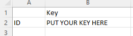

<!-- ### Load from quandl/NASDAQ -->
1. Get an API key from quandl.com.
2. Save that key in a csv file in the same directory as your code file. It should look like this

```{r echo=FALSE, out.width="25%", fig.align='left'}

```

In this example we are loading the adjusted closing price, which is the 11th column of the dataframe. We are loading daily data.
```{r}
rm(list=ls()) # clear workspace
cat("\014")  # clear console
library(Quandl)
quandl_api_key<-read.csv("../data/quandlkey.csv",stringsAsFactors=FALSE)
Quandl.api_key(quandl_api_key)
startd<-"2011-12-30"  
endd<-"2013-01-01"
freq<-"daily"
ticker<- c('WIKI/GOOGL.11','WIKI/IBM.11','WIKI/GE.11','WIKI/YHOO.11')
stock_prices = Quandl(ticker,start_date=startd, end_date=endd, collapse=freq,type="zoo")
names(stock_prices)=c('GOOG.Adjusted','IBM.Adjusted','GE.Adjusted','YHOO.Adjusted') 
```


