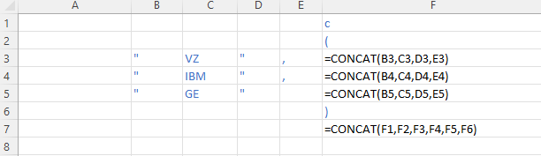
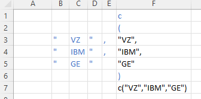
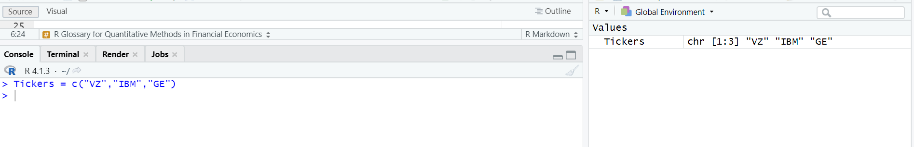

Task: Paste a list of tickers into R in order to conduct analysis. 

Step 1: Set up an XLS like below and use the CONCAT function

```{r pressure, echo=FALSE, out.width = '50%'}

```

The result should look like

```{r pressure2, echo=FALSE, out.width = '50%'}

```

Copy the result in F7. 


Step 2: Within R, name your vector and then paste your XLS vector

```{r pressure3, echo=FALSE, out.width = '50%'}

```